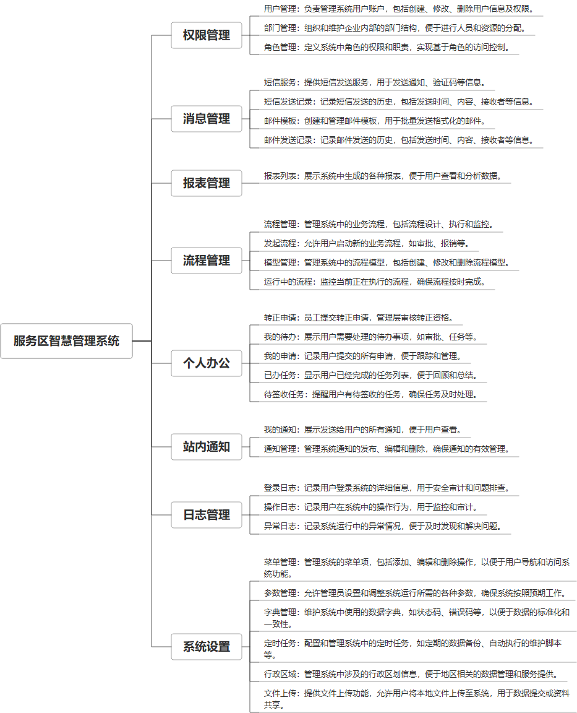

 

    
 

公司拥有上百套具有自主知识产权的软件系统，详情请查看码云首页或公司官网

 
<h1>服务区智慧管理系统</h1>

<a href="https://www.haishi.net.cn/">公司官网</a> ｜ <a href="https://www.haishi.net.cn/">在线体验</a>

 

## 系统介绍

“服务区智慧管理系统”是一个综合性的企业管理平台，专门设计用于优化服务区的运营和管理。系统集成了设备管理、通知管理、流程管理、邮件和短信服务等多种功能，以支持服务区内各种设施和服务的高效运作。通过这个系统，用户可以实现设备监控、设备维护记录、设备型号和类型的管理，同时还包括车位管理和停车场管理。系统还提供了视频监控、告警管理和异常日志功能，以保障服务区的安全。通过站内通知和远程控制功能，管理者可以实时监控运行中的流程并进行即时干预，确保服务区管理的智能化和迅速响应。这个系统旨在通过技术整合提升服务区的管理效率和服务质量。
“服务区智慧管理系统”是一个综合性的企业管理平台，专门设计用于优化服务区的运营和管理。系统集成了设备管理、通知管理、流程管理、邮件和短信服务等多种功能，以支持服务区内各种设施和服务的高效运作。通过这个系统，用户可以实现设备监控、设备维护记录、设备型号和类型的管理，同时还包括车位管理和停车场管理。系统还提供了视频监控、告警管理和异常日志功能，以保障服务区的安全。通过站内通知和远程控制功能，管理者可以实时监控运行中的流程并进行即时干预，确保服务区管理的智能化和迅速响应。这个系统旨在通过技术整合提升服务区的管理效率和服务质量。
本项目名称为服务区智慧管理系统，是对服务区从运力资源准备到最终货物抵达目的地的全流程管理。该系统主要包括日志管理、通知管理、数据大屏、权限管理、系统设置、消息管理、报表管理、流程管理、个人办公、站内通知等模块。该系统对服务区、人员、车辆等进行全面详细的统计考核，能大大提高服务区运作效率，降低运输成本，使服务区能够在激烈的市场竞争中处于领先地位。
                

## 系统功能介绍

### 系统包含终端说明

管理端（WEB）

| 序号 | 模块 | 模块说明 |
| --- | --- | --- |
| 1 | QT-FWQ-ZHGL-SERVER | 服务端 |
| 2 | QT-FWQ-ZHGL-MANAGE | 管理端 |

### 系统功能结构

### 系统功能说明

**日志管理：**
- 日志管理
**通知管理：**
- 通知管理
**数据大屏：**
- 数据大屏
**权限管理：**
- 用户管理
- 部门管理
- 角色管理
**系统设置：**
- 菜单管理
- 参数管理
- 字典管理
- 定时任务
- 行政区域
- 文件上传
**消息管理：**
- 短信服务
- 短信发送记录
- 邮件模板
- 邮件发送记录
**报表管理：**
- 报表列表
**流程管理：**
- 流程管理
- 发起流程
- 模型管理
- 运行中的流程
**个人办公：**
- 转正申请
- 我的待办
- 我的申请
- 已办任务
- 待签收任务
**站内通知：**
- 我的通知
- 通知管理

## 系统主要界面

## 系统技术说明

### 代码模块说明

| 序号 | 目录 | 目录说明 |
| --- | --- | --- |
| 1 | QT-FWQ-ZHGL-SERVER/renren-api | -- |
| 2 | QT-FWQ-ZHGL-SERVER/renren-dynamic-datasource | -- |
| 3 | QT-FWQ-ZHGL-SERVER/renren-common | -- |
| 4 | QT-FWQ-ZHGL-SERVER/renren-admin | -- |
| 5 | QT-FWQ-ZHGL-SERVER/.idea | -- |

### 系统技术选型

#### 开发语言/框架

JAVA（JDK1.8）
前端框架：VUE2
脚手架：Renren
系统结构：单体应用

#### 服务中间件

Nginx
Tomcat

#### 数据库

MySQL（5.7+）
Redis

#### 其他说明

无

## 系统演示/商用

请扫码添加客服微信获取演示地址和系统详细资料。

如果您想基于服务区智慧管理系统进行商业化交付或定制开发服务，我们提供有偿的技术服务支持，合作模式不限，欢迎沟通！

公司官网地址： <a href="https://www.haishi.net.cn/">https://www.haishi.net.cn</a>

联系客服获取专业回答。

## 使用须知

1、 本项目商用必须获得版权所有者的授权。

2、 未经允许本项目代码不允许二次出售。

